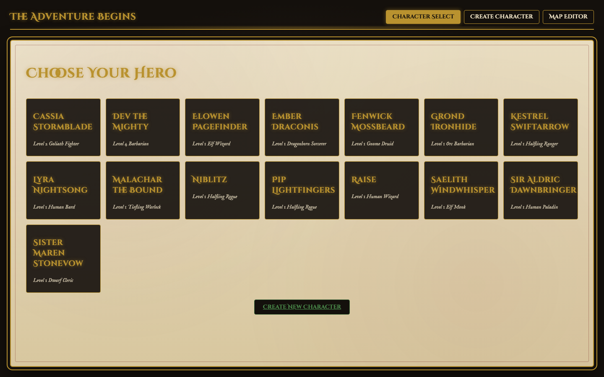
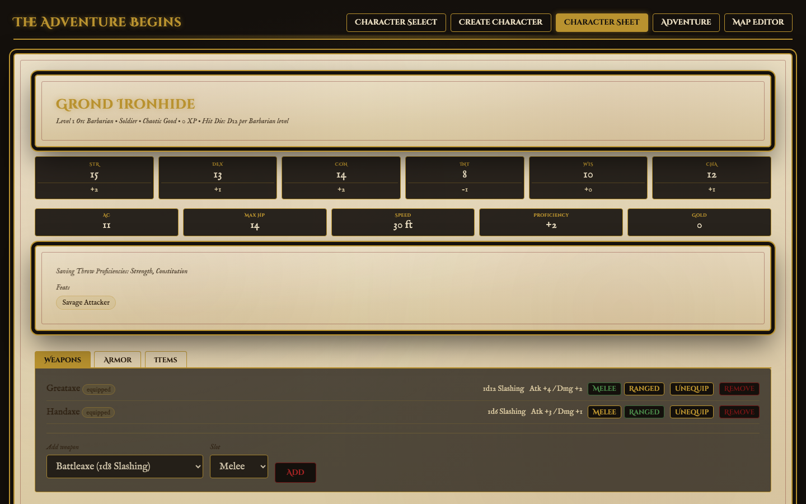
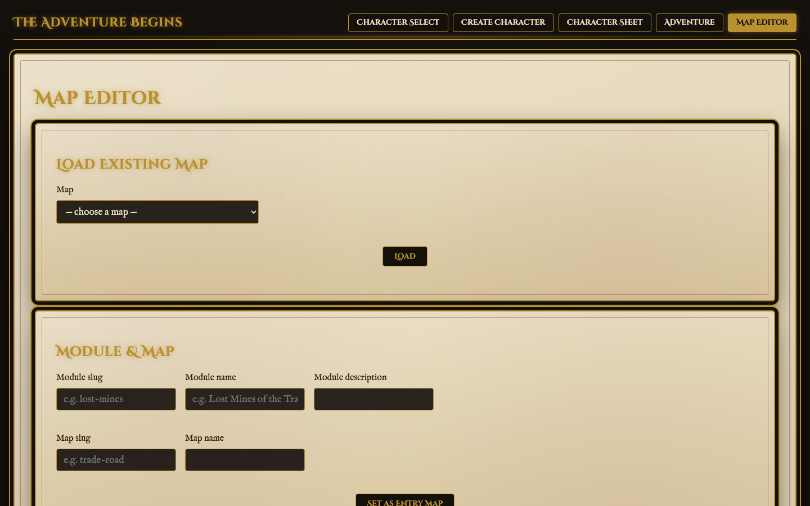

# dnd-game

A Dungeons & Dragons style game demo built on [ColdBox 8](https://coldbox.ortusbooks.com) running on the [BoxLang](https://boxlang.ortusbooks.com) runtime, with [CBWIRE](https://cbwire.ortusbooks.com) powering the reactive game UI and a MySQL-backed reference database seeded from the D&D 5e SRD 5.2.1.

## Requirements

- **BoxLang OS** 1.6+ — <https://boxlang.ortusbooks.com/getting-started/installation>
- **CommandBox** 6.0+ — <https://commandbox.ortusbooks.com/setup/installation> (dependency management, server runtime, testing, task automation)
- **MySQL** — a locally reachable server; this project stores its reference data in a `gameserver` schema

## Getting Started

```bash
# Install dependencies (ColdBox, CBWIRE, TestBox, etc.)
box install

# Create the schema and load the SRD reference data (classes, feats, magic items)
mysql -uroot < resources/database/migrations/001_srd_schema.sql
mysql -uroot gameserver < resources/database/seeds/srd_seed.sql

# Start the app
box server start
```

The app will be available at the URL CommandBox prints (see `server.json`). Copy `.env.example` to `.env` and adjust `DB_*` values if your MySQL server needs different credentials — it defaults to `root` with no password against `127.0.0.1:3306`.

## Screenshots

| Character Select | Character Sheet | Map Editor |
| --- | --- | --- |
|  |  |  |

## Architecture

This is a ColdBox HMVC app; see [CLAUDE.md](CLAUDE.md) for a deeper architectural rundown (including a section on BoxLang/ColdBox/CBWIRE metadata quirks worth knowing about before you go spelunking in `lib/`). The short version:

- **`app/`** — application code by ColdBox convention: `handlers/`, `models/`, `views/`, `layouts/`, `config/` (`Coldbox.bx`, `Router.bx`, `WireBox.bx`).
- **`app/wires/`** — CBWIRE components. The main game UI currently lives in `app/wires/default.bx`, rendered via `wire(name="default")` from `app/views/main/index.bxm` inside the dark fantasy themed layout at `app/layouts/Main.bxm`.
- **`public/`** — the actual webroot; `Application.bx` bootstraps ColdBox.
- **`runtime/boxlang.json`** — BoxLang engine-level config: mappings, the `gameserver` datasource (set as the app's default datasource), logging, module settings.
- **`lib/`** — vendor dependencies managed by CommandBox (`coldbox/`, `testbox/`, `modules/cbwire/`, `modules/route-visualizer/`). A couple of files under here carry local patches for BoxLang compatibility — see CLAUDE.md before overwriting them with a fresh `box install`.

## Game Data (`gameserver` MySQL schema)

Reference data (classes, subclasses, class features, feats, and magic items) is parsed from the [dnd-5e-srd-markdown](https://github.com/downfallx/dnd-5e-srd-markdown) SRD text and loaded into a `gameserver` MySQL schema:

| Table | Contents |
| --- | --- |
| `classes` | The 12 core classes — primary ability, hit die, proficiencies, starting equipment |
| `subclasses` | One example subclass per class, with tagline and description |
| `class_features` | Level-by-level class/subclass features, FK'd to `classes`/`subclasses` |
| `feats` | Origin, General, Fighting Style, and Epic Boon feats |
| `magic_items` | Magic items and artifacts — category, rarity, attunement requirements |

Schema: [resources/database/migrations/001_srd_schema.sql](resources/database/migrations/001_srd_schema.sql)
Importer: [resources/database/import_srd.py](resources/database/import_srd.py) — regenerates the seed file from the SRD markdown:

```bash
python3 resources/database/import_srd.py --srd-path /path/to/dnd-5e-srd-markdown
mysql -uroot < resources/database/migrations/001_srd_schema.sql
mysql -uroot gameserver < resources/database/seeds/srd_seed.sql
```

## Testing

TestBox specs live under `tests/specs`, with the runner configured in `box.json` (`tests/runner.bxm`):

```bash
box testbox run                                            # run everything
box testbox run bundles=tests.specs.integration.MainSpec    # run a single bundle
```

## Formatting

```bash
box run-script format         # format app/, tests/specs/, and root *.bx files
box run-script format:check   # check formatting without writing
```
